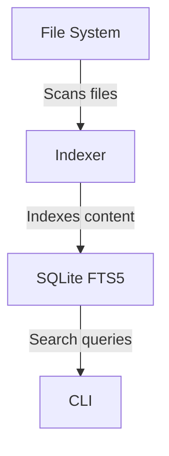
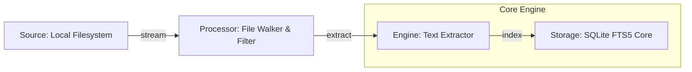
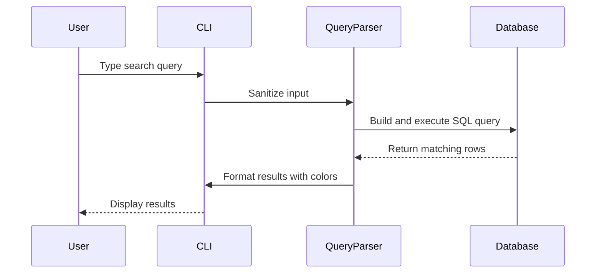

<div align="center">

```
██████╗  █████╗ ██████╗ ██╗██╗  ██╗
██╔══██╗██╔══██╗██╔══██╗██║██║ ██╔╝
██████╔╝███████║██████╔╝██║█████╔╝ 
██╔═══╝ ██╔══██║██╔═══╝ ██║██╔═██╗ 
██║     ██║  ██║██║     ██║██║  ██╗
╚═╝     ╚═╝  ╚═╝╚═╝     ╚═╝╚═╝  ╚═╝
```

**Search at the root.**


</div>

---

## 🔍 Demo

```bash
$ radix search "example query"

Results:
1. /path/to/file1.txt
   ...example query in context...

2. /path/to/file2.txt
   ...another example query result...

3. /path/to/file3.txt
   ...yet another result...
```

---

## ⚙️ How it Works



---

## 🚀 Quick Start

| Step       | Command                          | Description                     |
|------------|----------------------------------|---------------------------------|
| **Install**| `pip install radix-cli`          | Install Radix via pip.         |
| **Init**   | `radix init`                     | Initialize the Radix database. |
| **Search** | `radix search "example query"` | Search for a term.             |

---

## 🤔 Why Radix?

| Feature                | Radix         | Elasticsearch | Ripgrep       |
|------------------------|---------------|---------------|---------------|
| **Local-first**        | ✅            | ❌            | ✅            |
| **Lightweight**        | ✅            | ❌            | ✅            |
| **Full-text search**   | ✅            | ✅            | ❌            |
| **No external servers**| ✅            | ❌            | ✅            |
| **Customizable**       | ✅            | ✅            | ❌            |

---

## 🛠️ Indexing Pipeline



---

## 🔎 Search Logic



---

<details>
<summary>⚙️ Advanced Config</summary>

### Advanced Configuration

Radix supports advanced configuration through the `.radixignore` file and custom database paths.

#### Example `.radixignore` File
```
# Ignore temporary files
*.tmp
*.bak

# Ignore logs
*.log

# Ignore specific directories
node_modules/
venv/
```

#### Custom Database Path

You can specify a custom database path using the `RADIX_DB_PATH` environment variable:

```bash
export RADIX_DB_PATH=/custom/path/to/index.db
```

</details>

---

> **Radix: Search at the root.** Built for developers who demand speed, simplicity, and control.